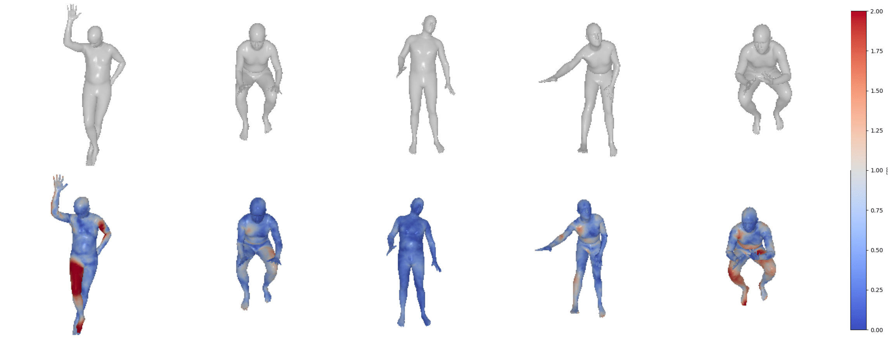

# Mesh-VQ-VAE

This repository implements Mesh-VQ-VAE, a vector-quantized autoencoder for human meshes used in [VQ-HPS](https://g-fiche.github.io/research-pages/vqhps/).

If you find this code useful, please consider citing the associated [paper](https://g-fiche.github.io/research-pages/vqhps/).



## Installation

### Create environment

    conda create -n meshvqvae python=3.9
    conda activate meshvqvae


### Install pytorch

    conda install pytorch=1.13.0 torchvision pytorch-cuda=11.6 -c pytorch -c nvidia


### Install pytorch3d

    # Install dependencies for pytorch3d
    conda install -c fvcore -c iopath -c conda-forge fvcore iopath
    conda install -c bottler nvidiacub

    # Install pytorch3d
    conda install pytorch3d -c pytorch3d

Please refer to the official [pytorch3d](https://github.com/facebookresearch/pytorch3d/blob/main/INSTALL.md) documentation for installation.

### Install other dependencies

    python -m pip install -r requirements.txt


## Data

This repository relies on various external downloads in order to run the code. Here is a description of each of them.

First, we create folders to store the downloads:
    mkdir body_models
    mkdir datasets

### Body models

The [SMPL-H](https://mano.is.tue.mpg.de/index.html) body model is used to obtain human meshes. To install the body model:
- Create an account on the [project-page](https://mano.is.tue.mpg.de/index.html)
- Go to the Downloads page and download the "Extended SMPL+H model (used in AMASS)". Place the downloaded smplh.tar.xz in the ```body_models``` folder and extract it.
- This should create a ```smplh``` folder. Rename the ```male``` subfolder to ```m``` and the ```female``` subfolder to ```f```.

### Fully convolutional mesh autoencoder

The Mesh-VQ-VAE encoder-decoder architecture is based on the fully convolutional mesh autoencoder (see the project page of the corresponding paper [[here]](https://zhouyisjtu.github.io/project_vcmeshcnn/vcmeshcnn.html)). In order to use this model, please download:
- The ```template.ply``` file available [here](https://github.com/papagina/MeshConvolution/tree/master/data/DFAUST), and place it in the ```body_models``` folder.
- The connection matrices of the mesh autoencoder available [here](https://github.com/papagina/MeshConvolution/tree/master/train/0223_GraphAE27_compare/connections) under the ```dfaust2``` folder. Rename the folder ```ConnectionMatrices``` and place it under the ```body_models``` folder.

### Datasets

Mesh-VQ-VAE is trained on the SMPL animation files used to create the [BEDLAM](https://bedlam.is.tue.mpg.de/index.html) dataset. To download this data:
- Create an account on the [project-page](https://bedlam.is.tue.mpg.de/index.html)
- Go to the Downloads page and download ```SMPL neutral``` placed in the ```SMPL ground truth/animation files``` section.
- Extract the downloaded data in the ```dataset``` folder and rename it ```bedlam_animations```.

To finetune and test Mesh-VQ-VAE, we use the annotations of the [3DPW](https://virtualhumans.mpi-inf.mpg.de/3DPW/) dataset:
- Download the ```sequenceFiles.zip``` file, and place it in a ```datasets/3DPW``` folder. Note that we do not need to download the images.
- Run ```python mesh_vq_vae/data/preprocess.py```. This will create ```npz``` files for each split of the 3DPW dataset. You can then delete the original dataset annotations.


## Train

You can train Mesh-VQ-VAE by running:

    python train_mesh_vqvae.py

The configuration of the model used in [VQ-HPS](https://g-fiche.github.io/research-pages/vqhps/) can be found under ```config_autoencoder/config_medium```. The pre-trained weights are in ```checkpoint/mesh-vqvae_54```.

To finetune Mesh-VQ-VAE, update the checkpoint in the configuration file and use:

    python finetune_mesh_vq_vae.py


## Test and analyze

Mesh-VQ-VAE can be tested using:

    python test_mesh_vqvae.py

Like for finetuning, the path of the checkpoint can be updated in the config file.

To visualize operations in the latent space, use:

    python analyze_vqvae.py --p "path_to_save_visualizations"


## Acknowledgements

This study is part of the EUR DIGISPORT project supported by the ANR within the framework of the PIA France 2030 (ANR-18-EURE-0022). This work was performed using HPC resources from the “Mésocentre” computing center of CentraleSupélec, École Normale Supérieure Paris-Saclay, and Université Paris-Saclay supported by CNRS and Région Île-de-France.

Some code in this repository is adapted from the following repositories:
- [MeshConvolution](https://github.com/papagina/MeshConvolution)
- [VQ-MAE-S](https://github.com/samsad35/VQ-MAE-S-code)
- [Pose-NDF](https://github.com/garvita-tiwari/PoseNDF/tree/version2)
- [HuMoR](https://github.com/davrempe/humor)
- [FastMETRO](https://github.com/postech-ami/FastMETRO)
